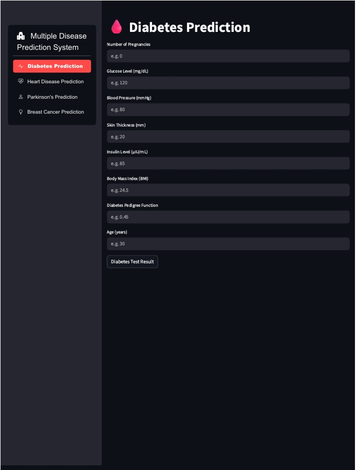
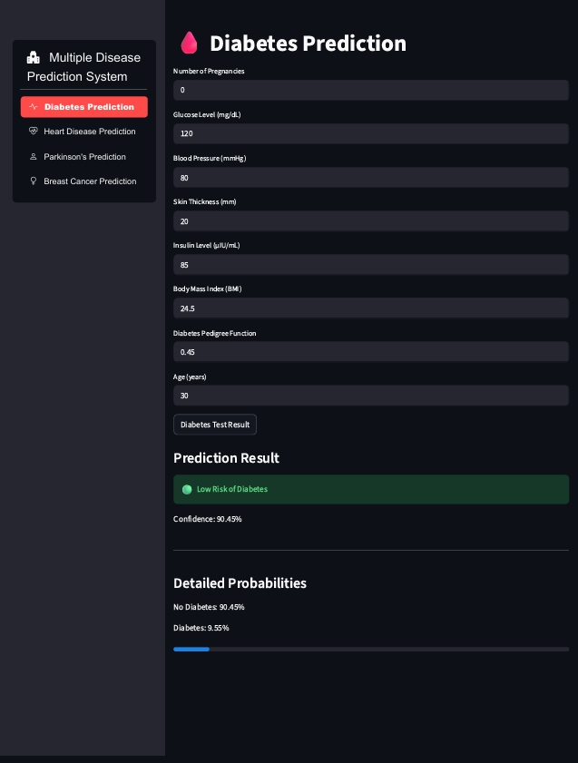
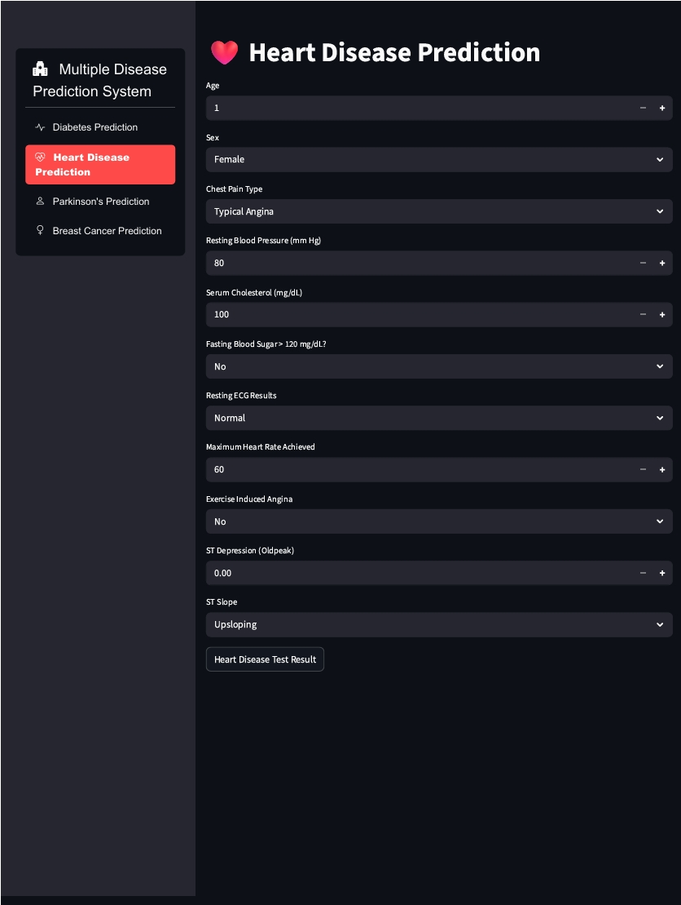
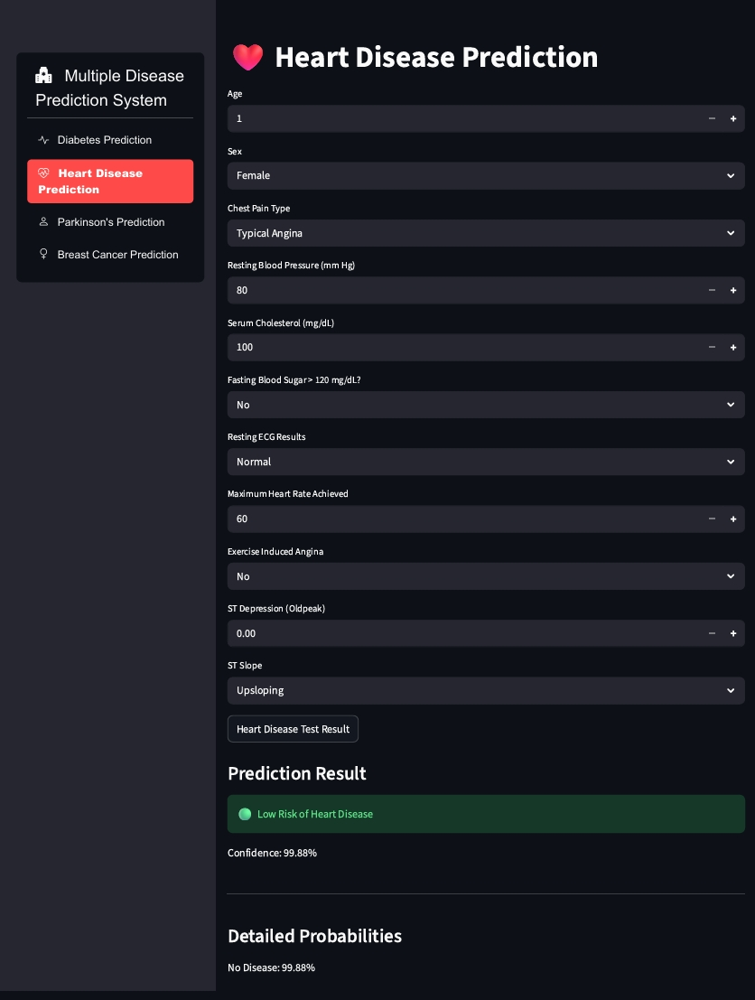
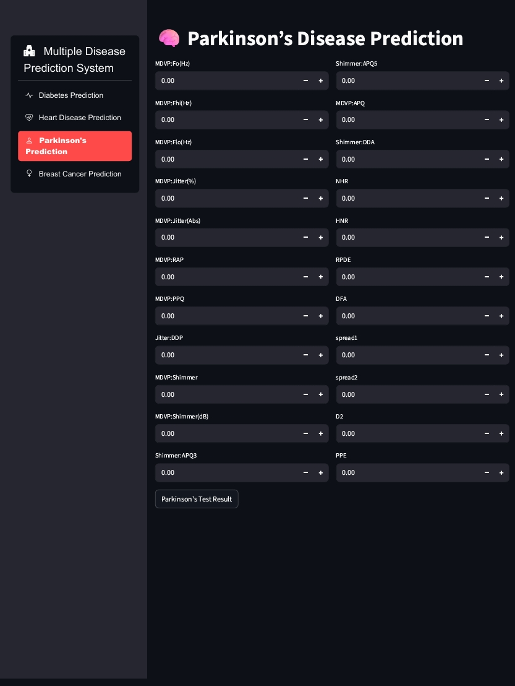
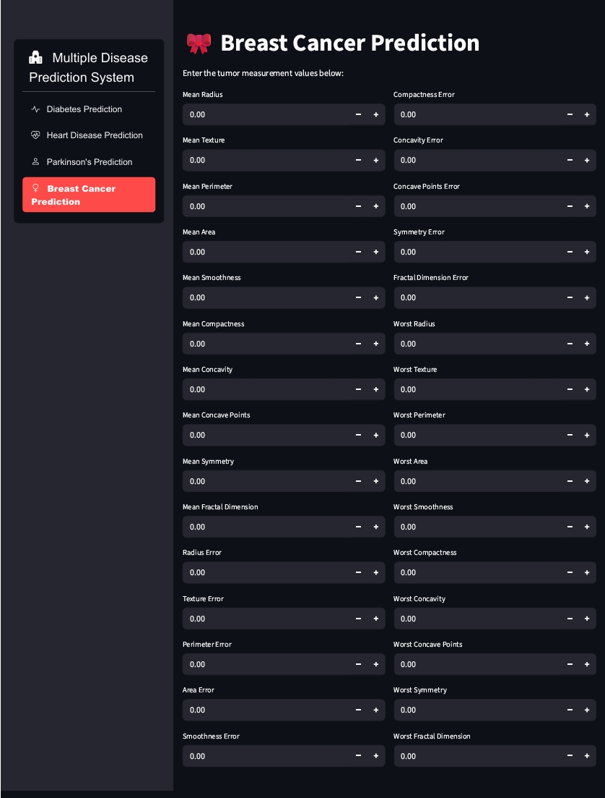

## 🏥 Multiple Disease Prediction System

A Machine Learning-based web application that predicts the likelihood of multiple diseases using medical input parameters. The project is built with Python and Streamlit and provides fast, interactive, and user-friendly disease prediction with confidence scores.

## 🚀 Features

✅ Diabetes Prediction 
✅ Heart Disease Prediction 
✅ Parkinson’s Disease Prediction 
✅ Breast Cancer Prediction 
✅ Interactive Streamlit UI 
✅ Prediction Confidence & Probability Scores 
✅ Input Validation & Error Handling 
✅ Deployed Online using Streamlit Cloud 

## 🧠 Machine Learning Models
Disease	Algorithm Used 
Diabetes	Logistic Regression 
Heart Disease	Machine Learning Classification Model 
Parkinson’s Disease	Support Vector Machine (SVM) 
Breast Cancer	Logistic Regression 

## 🛠️ Tech Stack
Python 
Streamlit 
Scikit-learn 
NumPy 
Pandas 
Pickle 
GitHub 
Streamlit Cloud 

## 📊 Prediction Output

The application displays:

Disease Prediction Result 
Confidence Percentage 
Detailed Probability Scores 
Visual Progress Indicator 

## 🌐 Deployment

The project is deployed using Streamlit Community Cloud.

## 📸 Application Screenshots

### 🩸 Diabetes Prediction

### ❤️ Heart Disease Prediction

### 🧠 Parkinson’s Prediction

### 🩺 Breast Cancer Prediction

## 📚 Datasets Used

Datasets used in this project were collected from:

Kaggle 
UCI Machine Learning Repository 
Scikit-learn Dataset Library 

## 🎯 Future Improvements
Add more disease prediction models 
Improve model accuracy 
Mobile responsive UI 
User authentication system 
Cloud database integration 

## 👨‍💻 Author
Aadarsh Chetry 
Akshay Shinde 
Mayuri Patil 

Final Year Machine Learning Project 
Multiple Disease Prediction System
